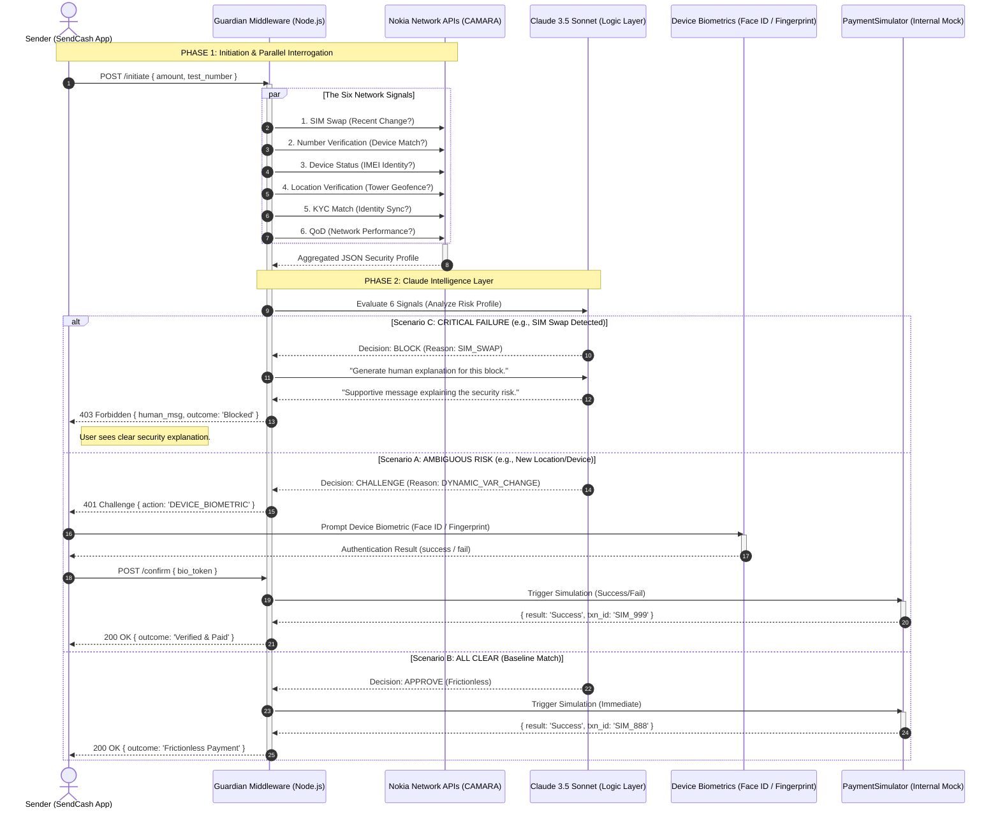

# GuardLayer: Adaptive Fraud Prevention Middleware

**GuardLayer** is a high-performance security middleware designed to bridge the structural gap between telecommunications networks and financial services. Across Sub-Saharan Africa, billions of dollars are lost annually to SIM swap fraud and account takeovers—not because of system hacks, but because payment platforms fail to "ask" the network if the person holding the SIM is the rightful owner.

GuardLayer closes this loop. By interrogating the **Nokia Network as Code (CAMARA)** APIs in real-time, GuardLayer provides an adaptive security layer that balances rigorous fraud prevention with a frictionless user experience.

---

##  The Core Innovation

GuardLayer doesn't just block transactions; it **thinks** about them. Using **Claude 3.5 Sonnet** as its logic engine, it evaluates six distinct network signals to decide the risk profile of every transaction in under two seconds.

### The Six Network Signals
*   **SIM Swap:** Has this SIM been changed in the last 24 hours?
*   **Number Verification:** Is the app currently running on the device tied to this number?
*   **Device Status:** Is this the user's recognized IMEI, or a new "burner" phone?
*   **Location Verification:** Is the phone pinging a tower in the user's usual geofence?
*   **KYC Match:** Does the app user's identity match the telco's RICA/FICA records?
*   **QoD (Quality on Demand):** Ensures a high-priority data path for secure verification.

---

##  System Architecture & Outcomes

GuardLayer evaluates these signals into three distinct outcomes:

1.  **Scenario A (Ambiguous Risk):** All clear, but a dynamic variable has changed (e.g., a new location). GuardLayer triggers a **Device-Native Biometric Check** (Face ID / Touch ID / Fingerprint). If passed, the payment is simulated.
2.  **Scenario B (Frictionless):** All signals match the user's baseline. The payment is simulated immediately without interrupting the user.
3.  **Scenario C (Critical Failure):** A high-risk event (like a recent SIM swap) is detected. The payment is blocked, and an AI-generated human explanation is sent to the user.

---

##  User Flow

The following diagram depicts the real-time interaction between the **SendCash App**, the **Nokia CAMARA** network, and the **Claude** logic layer.



---

##  Tech Stack

*   **Backend:** Node.js, Express.js, TypeScript.
*   **Database:** PostgreSQL (Audit logs & user baselines).
*   **AI:** Claude 3.5 Sonnet (Risk Assessment & Humanization).
*   **Network:** Nokia Network as Code (CAMARA Standard APIs).
*   **Biometrics:** Device-Native Authentication via `expo-local-authentication` (Face ID, Touch ID, Fingerprint).
*   **Mobile:** React Native (Mimic payment application).

##  Use Case
GuardLayer is built for African FinTechs, Neobanks, and Mobile Money Operators who need to protect their users from the "hidden" dangers of the telecom-banking gap without sacrificing the speed of modern mobile payments.

---

## Repository Layout

GuardLayer is an **NPM workspace + Turborepo monorepo**. Each role (P1–P4) ships in its own folder so the team can work in parallel without merge conflicts.

```
guard-layer/
├── package.json                       # root NPM workspace + turbo scripts
├── turbo.json                         # build/dev pipeline definitions
├── .env.example                       # required env vars (Nokia, Anthropic, ports)
├── ReadMe.md                          # this file
├── P1_Implementation.md               # P1 record (monorepo + CAMARA modules)
├── P3_Implementation.md               # P3 record (biometric + payment simulator)
├── P4_Implementation.md               # P4 record (real-time dashboard)
├── documentation.md                   # internal team brief (P1–P4 roles)
│
├── packages/
│   ├── shared/                        # P1 — SSE contract + decision constants
│   │   └── types.js
│   └── network-as-code-local/         # local Nokia SDK shim used by middleware
│
├── apps/
│   ├── middleware/                    # P1+P2+P3 — Express server
│   │   ├── server.js                  # POST /api/transaction/check, /stream, /confirm, /health
│   │   └── src/
│   │       ├── camara/                # P1 — six CAMARA modules
│   │       ├── agent/                 # P2 — signalFusion + decisionEngine (Claude)
│   │       ├── biometric/             # P3 — Smile ID liveness mock
│   │       └── payment/               # P3 — STK Push simulator
│   │
│   └── dashboard/                     # P4 — Vite + React + TypeScript
│       ├── index.html
│       ├── vite.config.ts
│       ├── tsconfig.json
│       └── src/
│           ├── App.tsx, main.tsx, index.css
│           ├── hooks/useGuardLayerSse.ts
│           ├── lib/{sseParse,consumePostSse,mockSsePlayback}.ts
│           ├── types/{guardLayer.ts,shared.d.ts}
│           └── components/
│               ├── SignalTimeline.tsx
│               ├── PipelineFlow.tsx
│               ├── DualScoreBar.tsx
│               ├── DecisionOutput.tsx
│               └── ImpactCounter.tsx
│
├── payment-app/                       # P5 — Expo / React Native SendCash app
└── scripts/
    └── test-nokia.js                  # P1 — parallel CAMARA smoke test
```

---

## Tech Stack (Implemented)

| Layer | Implementation |
| :--- | :--- |
| Backend (middleware) | Node.js 18+, Express 4, ES modules |
| Network APIs | Nokia Network as Code (CAMARA) via `network-as-code-local` shim, with `MOCK_MODE` fallback for offline demos |
| AI | Claude 3.5 Sonnet (`@anthropic-ai/sdk` semantics implemented in `decisionEngine.js`) with deterministic fallback |
| Mobile (SendCash) | Expo SDK 54, React Native 0.81, NativeWind, `expo-local-authentication` |
| Dashboard | Vite 5, React 18, TypeScript 5 (strict), SSE consumer over `fetch` + `ReadableStream` |
| Build orchestration | Turborepo + NPM workspaces |

---

## Prerequisites

- **Node.js 18+** and **npm 9+** (workspaces support).
- **PowerShell** on Windows or any POSIX shell on macOS/Linux.
- (Optional) **Anthropic API key** — without it, the middleware uses the deterministic fallback decision engine.
- (Optional) **Nokia Network as Code key** — without it, set `MOCK_MODE=true` and the CAMARA modules return scenario fixtures.
- (Optional, for the mobile app) **Expo Go** on a phone or an Android/iOS simulator.

---

## First-Time Setup

From the repository root:

```bash
git clone <this-repo>
cd guard-layer

# 1. Install all workspaces (middleware, dashboard, shared, network-as-code-local)
npm install

# 2. Configure environment
cp .env.example .env
# then edit .env and set:
#   ANTHROPIC_API_KEY=...   (optional; fallback engine works without it)
#   NOKIA_API_KEY=...       (optional when MOCK_MODE=true)
#   MOCK_MODE=true
#   PORT=3000
#   DASHBOARD_PORT=3001     (informational; dashboard dev server uses 5173)
```

The mobile app has its own dependency tree:

```bash
cd payment-app
npm install
cd ..
```

---

## Running The System

You typically need **two terminals** for the desktop demo (middleware + dashboard) and a **third** if you also want the SendCash mobile app.

### Terminal 1 — Middleware (P1 / P2 / P3)

```bash
npm run dev --workspace=@guard-layer/middleware
# → GuardLayer middleware listening on http://localhost:3000
```

Endpoints:
- `GET  /health` — liveness check
- `POST /api/transaction/check` — single JSON response (USSD / legacy clients)
- `POST /api/transaction/check/stream` — Server-Sent Events pipeline
- `POST /confirm` — biometric escalation + STK Push simulator (see `P3_Implementation.md`)

### Terminal 2 — Dashboard (P4)

```bash
# Mock mode (no middleware required)
npm run dev --workspace=@guard-layer/dashboard
# → Vite dev server on http://localhost:5173
```

For **live mode** (proxies `/api` to the middleware on `:3000`):

```bash
echo "VITE_USE_LIVE_SSE=true" > apps/dashboard/.env.local
npm run dev --workspace=@guard-layer/dashboard
```

In the dashboard UI:
- **Run clear scenario** — drives an `APPROVE` decision through the pipeline.
- **Run elevated scenario** — drives `BLOCK` with explanation copy.
- **Stop** / **Reset session** — abort the in-flight stream / clear counters.

### Terminal 3 — SendCash Mobile App (P5, optional)

```bash
cd payment-app
npx expo start
# Scan the QR with Expo Go, or press a / i for Android / iOS.
```

The app calls the middleware over LAN — make sure your phone is on the same network and use your machine's LAN IP (not `localhost`) inside the app's middleware base URL.

---

## Smoke Tests

### Verify the middleware
```bash
curl http://localhost:3000/health
# → {"ok":true,"service":"guard-layer-middleware"}
```

### Run the parallel CAMARA test (P1)
```bash
npm run test:nokia
# → JSON output of all six signals for the full_attack scenario
```

### Hit the JSON pipeline (P2)
```bash
curl -X POST http://localhost:3000/api/transaction/check \
  -H "Content-Type: application/json" \
  -d "{\"phoneNumber\":\"+358401234567\",\"scenario\":\"all_clear\"}"
```

### Hit the streaming pipeline (P2 / P4 contract)
```bash
curl -N -X POST http://localhost:3000/api/transaction/check/stream \
  -H "Content-Type: application/json" \
  -H "Accept: text/event-stream" \
  -d "{\"phoneNumber\":\"+358401234567\",\"scenario\":\"recent_sim_swap\"}"
```
You should see the `stage` → `signal` ×6 → `raw_score` → `decision` → `complete` sequence — the same one the dashboard renders.

### Confirm path (P3)
See `P3_Implementation.md` for the three documented `POST /confirm` scenarios (Trigger Selfie, Verify & Pay, USSD Fallback) with full curl examples.

---

## Demo Flow (Judge-Friendly)

1. Start the middleware (Terminal 1) and the dashboard in **live mode** (Terminal 2).
2. From the SendCash app or a curl call, send a **`recent_sim_swap`** transaction.
3. Watch the dashboard:
   - **PipelineFlow** moves from Stage 1 (Triage) to Stage 2 (Investigation).
   - **SignalTimeline** paints six cards as each Nokia CAMARA call completes; bad signals turn red.
   - **DualScoreBar** fills the pre-AI fusion bar, then the AI risk bar.
   - **DecisionOutput** lands on `BLOCK` with the plain-language explanation.
   - **ImpactCounter** increments transactions checked / fraud blocked / value protected.
4. Repeat with `all_clear` to see the frictionless `APPROVE` outcome.
5. (Optional) Repeat with `location_anomaly` to see the `CHALLENGE` outcome and call `POST /confirm` with `bio_token` to complete payment via the STK simulator.

---

## Troubleshooting

| Symptom | Likely cause | Fix |
| :--- | :--- | :--- |
| Dashboard shows `Mock SSE` even though I want live mode | `apps/dashboard/.env.local` not present or wrong key | Create the file with `VITE_USE_LIVE_SSE=true` and restart `npm run dev`. |
| Dashboard banner: `Failed to fetch` / CORS | Middleware not running on `:3000` or different port | Confirm with `curl http://localhost:3000/health`; if your `PORT` differs, update `apps/dashboard/vite.config.ts` proxy target. |
| Decision panel always says fallback | `ANTHROPIC_API_KEY` missing or placeholder | Set a real key in `.env`, or accept the deterministic fallback (it still demos the UI correctly). |
| `npm install` fails on Windows with EBUSY | OneDrive sync on the workspace folder | Pause OneDrive while installing, or move the repo outside OneDrive. |
| `npm run build --workspace=@guard-layer/dashboard` fails with TS errors | Stale `node_modules` after toolchain change | `rm -rf node_modules apps/*/node_modules && npm install`. |
| Mobile app cannot reach middleware | Phone hitting `localhost` of phone, not laptop | Use your laptop's LAN IP and ensure firewall allows inbound on `:3000`. |

---

## Per-Role Documentation

| Role | Document |
| :--- | :--- |
| P1 — Monorepo + Nokia CAMARA modules | [`P1_Implementation.md`](./P1_Implementation.md) |
| P2 — Decision engine + SSE pipeline | implemented in `apps/middleware/src/agent/` and `server.js` |
| P3 — Biometric escalation + payment simulator | [`P3_Implementation.md`](./P3_Implementation.md) |
| P4 — Real-time dashboard | [`P4_Implementation.md`](./P4_Implementation.md) |
| Team brief / role boundaries | [`documentation.md`](./documentation.md) |
