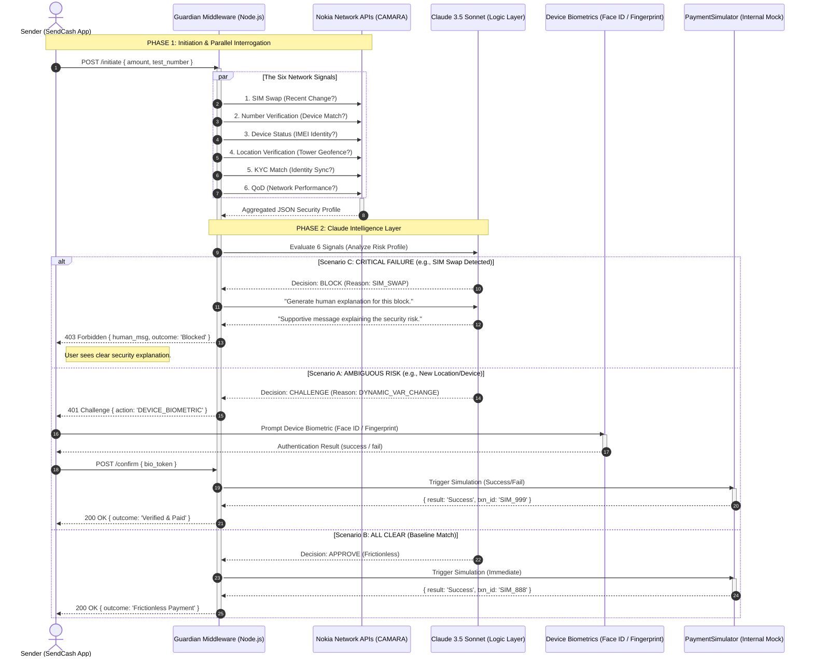

# GuardLayer: Adaptive Fraud Prevention Middleware

**GuardLayer** is a high-performance security middleware designed to bridge the structural gap between telecommunications networks and financial services. Across Sub-Saharan Africa, billions of dollars are lost annually to SIM swap fraud and account takeovers—not because of system hacks, but because payment platforms fail to "ask" the network if the person holding the SIM is the rightful owner.

GuardLayer closes this loop. By interrogating the **Nokia Network as Code (CAMARA)** APIs in real-time, GuardLayer provides an adaptive security layer that balances rigorous fraud prevention with a frictionless user experience.

---

##  The Core Innovation

GuardLayer doesn't just block transactions; it **thinks** about them. Using **Claude 3.5 Sonnet** as its logic engine, it evaluates six distinct network signals to decide the risk profile of every transaction in under two seconds.

### The Six Network Signals
*   **SIM Swap:** Has this SIM been changed in the last 24 hours?
*   **Number Verification:** Is the app currently running on the device tied to this number?
*   **Device Status:** Is this the user's recognized IMEI, or a new "burner" phone?
*   **Location Verification:** Is the phone pinging a tower in the user's usual geofence?
*   **KYC Match:** Does the app user's identity match the telco's RICA/FICA records?
*   **QoD (Quality on Demand):** Ensures a high-priority data path for secure verification.

---

##  System Architecture & Outcomes

GuardLayer evaluates these signals into three distinct outcomes:

1.  **Scenario A (Ambiguous Risk):** All clear, but a dynamic variable has changed (e.g., a new location). GuardLayer triggers a **Device-Native Biometric Check** (Face ID / Touch ID / Fingerprint). If passed, the payment is simulated.
2.  **Scenario B (Frictionless):** All signals match the user's baseline. The payment is simulated immediately without interrupting the user.
3.  **Scenario C (Critical Failure):** A high-risk event (like a recent SIM swap) is detected. The payment is blocked, and an AI-generated human explanation is sent to the user.

---

##  User Flow

The following diagram depicts the real-time interaction between the **SendCash App**, the **Nokia CAMARA** network, and the **Claude** logic layer.

---

##  Tech Stack

*   **Backend:** Node.js, Express.js, TypeScript.
*   **Database:** PostgreSQL (Audit logs & user baselines).
*   **AI:** Claude 3.5 Sonnet (Risk Assessment & Humanization).
*   **Network:** Nokia Network as Code (CAMARA Standard APIs).
*   **Biometrics:** Device-Native Authentication via `expo-local-authentication` (Face ID, Touch ID, Fingerprint).
*   **Mobile:** React Native (Mimic payment application).

##  Use Case
GuardLayer is built for African FinTechs, Neobanks, and Mobile Money Operators who need to protect their users from the "hidden" dangers of the telecom-banking gap without sacrificing the speed of modern mobile payments.
